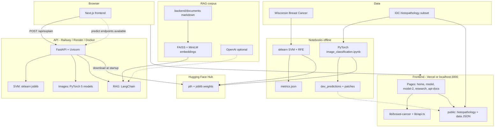

# TumorSense


TumorSense is an end-to-end SVM classification pipeline built on the Wisconsin Breast Cancer Diagnostic dataset. It reduces 30 raw cell nucleus measurements down to the 10 most predictive features and achieves high discriminatory performance providing a reliable, data-driven second opinion for ambiguous fine needle aspiration (FNA) cases.

Interactive full-stack workshop for breast cancer classification: **Wisconsin (WDBC) SVMs** on tabular FNA features and **PyTorch CNNs / ViT** on IDC histopathology patches. Includes research dashboards, explainable AI (RAG, saliency, PCA), and a FastAPI backend deployable to **Railway** with weights on **Hugging Face Hub**.

### Live Demo

[**View TumorSense Website →**](https://tumorsense-production.up.railway.app/)

Also available at: [tumorsense-ntrueba-5031s-projects.vercel.app](https://tumorsense-ntrueba-5031s-projects.vercel.app)

### Model Weights

Trained SVM (joblib) and image model (PyTorch `.pth`) weights are hosted on Hugging Face Hub:

[**stvngo/tumorsense-weights →**](https://huggingface.co/stvngo/tumorsense-weights/tree/main)

---

### Why not just use tumor size?


Tumor size alone leaves a large overlap zone where benign and malignant cases are indistinguishable. TumorSense uses 10 cell nucleus measurements together to resolve exactly these ambiguous cases.

---

## Results at a Glance

| Metric | Score |
|---|---|
| Malignant Recall | **98%** |
| Malignant Precision | **98%** |
| ROC-AUC | **0.995** |

A false negative (calling a malignant tumor benign) is a life-threatening error. The model was evaluated with this asymmetry in mind.

---

## Architecture

### End-to-end system





---

## Overview

| Layer       | Technology                                                                     | Role                                 |
| ----------- | ------------------------------------------------------------------------------ | ------------------------------------ |
| Frontend    | Next.js 15, React, TypeScript, Tailwind, shadcn/ui, Lucide, Three.js, Recharts | Workshops, research UI, API docs     |
| Backend     | FastAPI, Uvicorn, Pydantic                                                     | SVM + image inference, RAG           |
| ML training | Jupyter, scikit-learn, PyTorch, torchvision, timm                              | Fit models, export metrics           |
| Weights     | [Hugging Face Hub](https://huggingface.co/stvngo/tumorsense-weights/tree/main) | Host joblib and pth files not in git |
| Deploy      | Vercel (UI), Railway or Render (API), optional GHCR image                      | Production                           |

---

## Methodology

### 1. Data Preprocessing
- Dataset: [UCI Wisconsin Breast Cancer Diagnostic Dataset](https://archive.ics.uci.edu/ml/datasets/Breast+Cancer+Wisconsin+(Diagnostic)) (569 samples, 30 features)
- Stratified train-test split to preserve class balance across both sets

### 2. Feature Selection
- Applied **Recursive Feature Elimination (RFE)** with a `LinearSVC` estimator
- Reduced 30 raw features → **top 10 most predictive features**


### 3. Model Training
- **Algorithm:** Support Vector Machine with 4 kernels: **RBF, Linear, Polynomial (degree 3), and Sigmoid**
- **Hyperparameter tuning:** `GridSearchCV` over `C` and `gamma`
- Best parameters selected via cross-validated grid search
- All 4 models serialized and served live via a Flask API (`/api/predict`)

### 4. Evaluation
- Precision, Recall, F1 per class
- ROC-AUC score
- SHAP summary plot for model explainability


`texture3` and `concave_points1` carry the most weight in pushing predictions toward malignant. High feature values (pink) generally shift the model toward malignant; low values (blue) toward benign.

---

## Datasets and Experiments

### Wisconsin Breast Cancer (WDBC) — SVM

- **569** fine-needle aspirates, **30** features; UI exposes **10 mean** features after RFE.
- Kernels: **linear, RBF, polynomial, sigmoid** with grid search.
- Outputs: `backend/outputs/svm_out/metrics.json` (in git), `model_*.joblib` + `scaler.joblib` ([on HF](https://huggingface.co/stvngo/tumorsense-weights/tree/main)).
- Site: live decision-boundary workshop, confusion matrix, learning curves, optional `POST /api/predict`.

### IDC histopathology — deep learning

- **36** class-balanced **50×50** RGB patches in `public/histopathology/`.
- **5** architectures: BaselineCNN, VGG-16, MobileNet-V2, ResNet-18, ViT-Tiny (`image_classification.ipynb`).
- **Patient 9344** whole-slide probability landscape (ResNet-18 overlays on stitched tissue).
- Precomputed: `public/data/gallery_predictions.json` for all models × all gallery patches.

---

## Webpages

| Route       | Description                                                                                                                            |
| ----------- | -------------------------------------------------------------------------------------------------------------------------------------- |
| `/`         | Landing — about, motivation, results                                                                                                   |
| `/model`    | SVM workshop — sliders, 2D feature space, stats, **RAG** via button                                                                    |
| `/model-2`  | Image workshop — gallery, leaderboard, 3D arch, forward pass, saliency, embeddings, eigen-patches, probability landscape, segmentation |
| `/research` | Background, EDA, RFE; tabs for ML/XAI, statistics, case studies                                                                        |
| `/api-docs` | API reference and curl examples                                                                                                        |

---

## API

Base URL: `NEXT_PUBLIC_API_URL` (default `http://localhost:8000`). Swagger: `/docs`.

| Method | Path                      | Description              |
| ------ | ------------------------- | ------------------------ |
| GET    | `/health`                 | Status and loaded models |
| GET    | `/api/models`             | SVM kernels              |
| GET    | `/api/feature-names`      | 10 feature names         |
| GET    | `/api/metrics`            | Training metrics JSON    |
| POST   | `/api/predict`            | SVM inference            |
| GET    | `/api/image/models`       | Image model list         |
| POST   | `/api/image/predict`      | Image inference (base64) |
| POST   | `/api/image/predict-file` | Image inference (upload) |
| POST   | `/api/explain`            | RAG explanation          |

Wired in the UI today: **`POST /api/explain`** (on button press). SVM and image predict endpoints are implemented; the workshops primarily use client logic and static JSON for responsiveness.

---

## Repository Structure

```
TumorSense/
├── backend/
│   ├── models/
│   │   ├── model_rbf.joblib
│   │   ├── model_linear.joblib
│   │   ├── model_poly.joblib
│   │   ├── model_sigmoid.joblib
│   │   ├── scaler.joblib
│   │   └── metrics.json
│   ├── server.py
│   ├── train_models.py
│   ├── requirements.txt
│   └── Procfile
├── frontend/
│   ├── app/
│   ├── components/
│   ├── hooks/
│   ├── lib/
│   ├── public/
│   ├── styles/
│   ├── next.config.mjs
│   ├── package.json
│   └── tsconfig.json
├── notebooks/
│   └── tumor_sense.ipynb
├── visuals/
│   ├── misclass.png
│   ├── rfe_feature_rankings.png
│   └── shap.png
├── LICENSE
└── README.md
```

## Repository Layout

```
app/                 # Next.js routes
components/          # landing, model, model-2, research, api-docs, ui (shadcn)
lib/                 # api.ts, breast-cancer mocks and helpers
public/              # histopathology patches, precomputed JSON
backend/             # FastAPI, RAG docs, scripts, Dockerfile, DEPLOY.md
image_classification.ipynb
render.yaml          # optional Render blueprint
```

---

## Getting Started

### Try it live

Visit the deployed app: [tumorsense-ntrueba-5031s-projects.vercel.app](https://tumorsense-ntrueba-5031s-projects.vercel.app)

Or: [tumorsense-production.up.railway.app](https://tumorsense-production.up.railway.app/)

### Run locally

#### Frontend

From **repo root**:

```bash
npm install
npm run dev
```

`.env.local` (optional):

```env
NEXT_PUBLIC_API_URL=http://localhost:8000
```

Legacy frontend path (if using a `frontend/` subdirectory):

```bash
cd TumorSense/frontend

npm install
npm run dev
```

#### Backend

From **repo root**:

```bash
python -m venv backend/.venv
source backend/.venv/bin/activate
pip install -r backend/requirements.txt
cp backend/.env.example backend/.env
uvicorn backend.server:app --reload --port 8000
```

Legacy backend path:

```bash
git clone https://github.com/nathaniel-trueba/TumorSense.git
cd TumorSense/backend

pip install -r requirements.txt
python server.py
```

Place trained weights in `backend/models/` or set `TUMORSENSE_WEIGHTS_BASE_URL` to the [Hugging Face weights repo](https://huggingface.co/stvngo/tumorsense-weights/tree/main) (e.g. `https://huggingface.co/stvngo/tumorsense-weights/resolve/main/`).

#### Notebook

```bash
cd TumorSense

pip install -r backend/requirements.txt
jupyter notebook notebooks/tumor_sense.ipynb
```

---

## Deployment

1. Weights are published at [stvngo/tumorsense-weights](https://huggingface.co/stvngo/tumorsense-weights/tree/main). To update, upload `backend/models/` to a **public** HF repo (`hf auth login`, `hf upload …`).
2. Deploy API to **Railway** (Dockerfile or GHCR image) or **Render** (`render.yaml`).
3. Set `TUMORSENSE_WEIGHTS_BASE_URL`, `TUMORSENSE_CORS_ORIGINS`, optional `OPENAI_API_KEY`.
4. Deploy frontend to Vercel with `NEXT_PUBLIC_API_URL` pointing at the API host.

Details: **[backend/DEPLOY.md](backend/DEPLOY.md)**

---

## Environment Variables

| Variable                      | Where    | Purpose             |
| ----------------------------- | -------- | ------------------- |
| `NEXT_PUBLIC_API_URL`         | Frontend | API base URL        |
| `TUMORSENSE_WEIGHTS_BASE_URL` | Backend  | HF weights base URL |
| `TUMORSENSE_CORS_ORIGINS`     | Backend  | CORS allowlist      |
| `OPENAI_API_KEY`              | Backend  | LLM RAG (optional)  |

---

## Authors

- **Vedant Vardhaan**
- **Steven Ngo**
- **Nathaniel Trueba**
- **Kavya Shah**
- **Evan Park**

---

## ⚠️ Disclaimer ⚠️

> TumorSense is an academic project and is **not intended for clinical use**. All results are derived from a publicly available research dataset and should not be used to inform medical decisions. Third-party datasets and papers retain their original licenses and citations.
